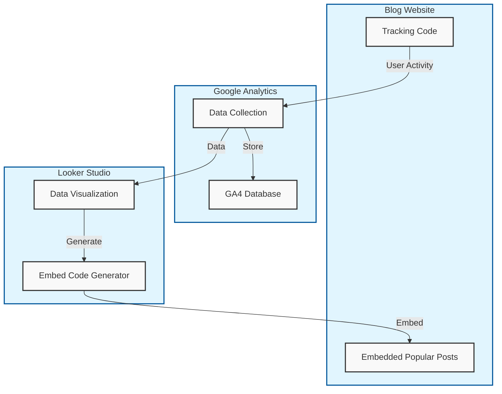

# 프로젝트 기획

운영중인 블로그의 방문자 수를 늘리기 위해 인기 글 5개를 보여주는 서비스를 추가하고 싶어서 해당 프로젝트를 시작해봅니다.

# 아키텍쳐

```mermaid
flowchart TD
    subgraph Blog["Blog Website"]
        A1[Tracking Code]
        A2[Embedded Popular Posts]
    end

    subgraph Analytics["Google Analytics"]
        B1[Data Collection]
        B2[GA4 Database]
    end


    subgraph Visualization["Looker Studio"]
        D1[Data Visualization]
        D2[Embed Code Generator]
    end

    A1 -->|User Activity| B1
    B1 -->|Store| B2
    B1 -->|Data| D1
    D1 -->|Generate| D2
    D2 -->|Embed| A2

    classDef default fill:#f9f9f9,stroke:#333,stroke-width:2px;
    classDef highlight fill:#e1f5fe,stroke:#01579b,stroke-width:2px;

    class Blog,Analytics,Backend,Visualization highlight
```

# 기술 스택

- Google Analytics -> 수집
- Looker Studio -> 임베드 코드 제공

### 테스트

- @google-analytics/data
- Node.js
